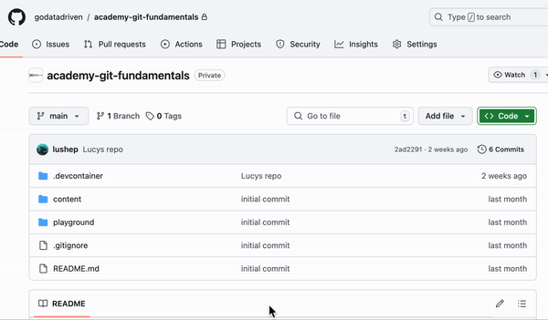

# git and GitHub Fundamentals training 🧑‍🏫

## Getting started 🧑‍💻

There are two options for you to get started with the material.

1. Using Code Spaces

2. Using your own machine

### Using Code Spaces ☁️

In the Github repository, click on the green button `Code` and select `Open with Code Spaces`. This will open a new browser tab with a Code Space. You can now start working in the terminal. 



You can also open the container in your local VS Code by clicking on `Open with VS Code` from the command pallette (press `Ctrl + Shift + P` to open the command pallette).

### Using your own machine 💻

#### Prerequisites

- [Git](https://git-scm.com/downloads)
- [Bash](https://www.gnu.org/software/bash/)

#### Clone the repository

Clone the repository to your local machine:

```bash
$ git clone https://github.com/godatadriven/academy-shell-and-git.git
```

You're good to go! 🎉


## Exercises 🙇

All the content and exercises can be found in the `content` folder in this repository.
