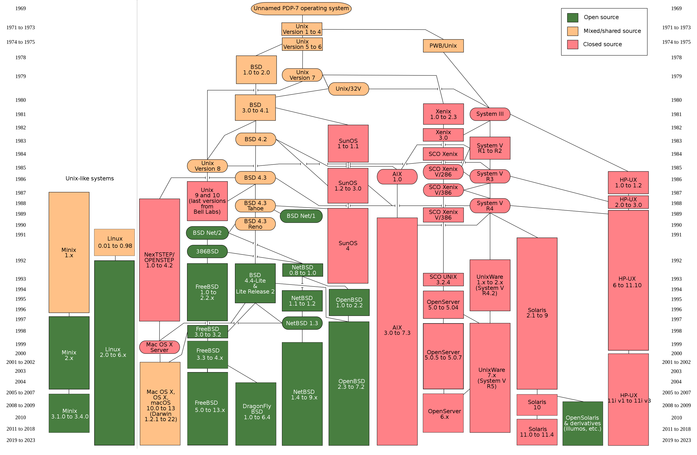

# Unix introduction

What is Unix? And how do shell and bash fit into the picture?

## What is Unix?

Unix is an operating system created around the 1970s at Bell Labs, and has been in use ever since. POSIX (Portable Operating System Interface) is a set of standards that define how Unix-like operating systems should behave. Unix forms the basis for many other operating systems, including Linux and Mac OS X, except Windows.

Fun fact: the C-language was created to develop Unix. It is a programming language that is still widely used today.

A nice overview of Unix-based or inspired operating systems can be found [here](https://en.wikipedia.org/wiki/History_of_Unix#/media/File:Unix_history-simple.svg).

## What is a shell?

A shell is a user interface for accessing an operating system's services. It allows users to interact with the operating system by executing commands, either by typing them in or through scripts. Shells can be graphical or command-line based. In Unix-like systems, the shell is a command-line interface (CLI) that interprets and executes user commands, as well as providing built-in commands for common tasks.

## What is a terminal?

A terminal, also known as a console or command-line interface (CLI), is a text-based interface that allows users to interact with the operating system by entering commands and receiving text-based output.

Think of the terminal as the interface you use to access the shell. The terminal is the text-based application where you type commands, and the shell is the program that interprets and executes those commands. Starting a terminal starts a new instance of the shell.

## What is bash?

Bash (Bourne-Again SHell) is a Unix shell and command-line interpreter, which is the default shell for many Unix-based systems, including Linux and macOS.

Alternatives to bash include zsh (Z shell) and fish (Friendly Interactive SHell) and several others.

## Exercises

1. Open a terminal on your machine.
2. Enter `echo $SHELL` to see which shell you are using.
