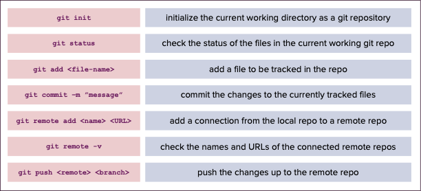

# Exercises: Working with git individually
Exercises

## The command line

Use the Terminal** in the codespaces to do the following:

1. Display the current working directory . Which folder are you currently in?
1. List all the items in your current working directory.
1. Make a new directory (folder) called test. 
1. Check your Explorer, does the folder now exist?
1. Navigate to the new folder test and print the working directory.


**can't see the Terminal? Use the keyboard shortcut to open it!
```
control + `
```

## 2. Make your first commit and push

Make sure you are working in the `xebia-git-training` folder:

1. Initialize the folder as a git repository
1. Add the remote repository that you already created on GitHub and call it `origin`
1. Check the status: which file can be tracked?
1. Add the file to be tracked using `git add <file-name>`
1. Commit the file with the message `“initial commit”`
1. Push the commit to the remote repository using `git push origin main`
1. Check the remote repository. Did it update?
1. Add your name to the `new_file.txt` and repeat steps 4-8



## Branches

Make sure you are working in the `xebia-git-training` folder
1. Make a new branch called `feature/your_name`
1. Add a new file called `second_file.txt`
1. Update `new_file.txt` by removing your name and adding a joke into the file
1. Add and commit your changes locally
1. Push your changes using from your new branch to origin
1. Check the remote repository and navigate to your new branch to see the changes
1. Open a Pull Request and compare the changes

