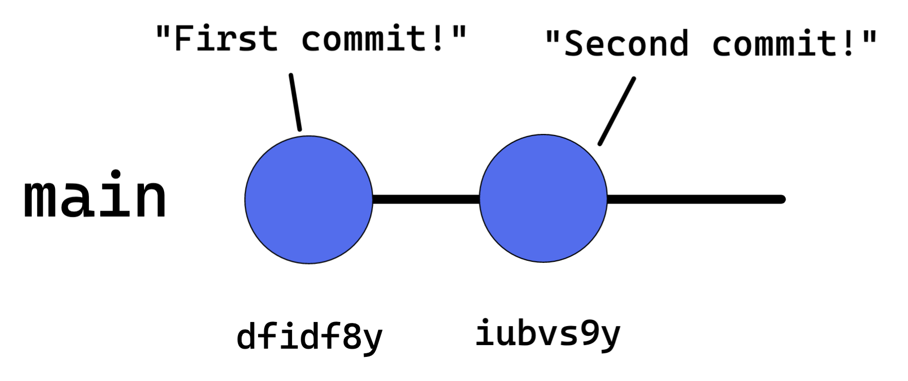
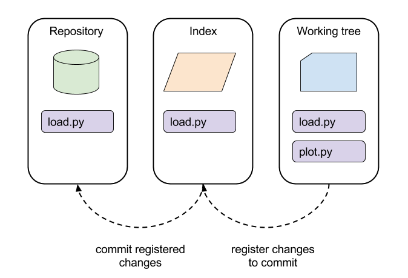

# Adding and Committing Changes

In this section, you'll see the essential steps for adding and committing changes to your Git repository.



## Staging Changes (git add)

To stage changes for a commit, use the git add command followed by the file(s) you want to stage.

```bash
git add .  # stage all changes
git add file1.txt file2.txt  # stage specific files
```

## Committing Changes (git commit)

Once your changes are staged, use the git commit command to create a new commit. Add the `-m` flag followed by your commit message in quotes.

```bash
git commit -m "Add new feature"
```

## A few workds on terminology

Working directory (i.e. you local file system) is often referred to as working tree. The staging area is also called the index. The index is a staging area between the working tree and the repository.


## Writing Good Commit Messages

A good commit message is concise, clear, and explains the purpose of the commit. Start with a short summary (50 characters or less) followed by an optional longer description.

- Use the imperative mood (e.g., "Add feature" instead of "Added feature")
- Explain what the commit does and why, not how it does it
- Limit the summary line to 50 characters and wrap the description at 72 characters.
Example: 
```text
Add user authentication

- Implement login functionality
- Add password encryption
- Update user model
```
