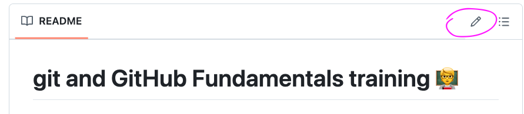

# Checking Differences Between Commits

In this section, you will explore how to check the differences between commits.

## Viewing Changes Between the Working Directory and the Staging Area

To view the changes between your working directory and the staging area, use the following command:
```bash
git diff
```

This will show you the differences between your working directory and the staged changes.

## Viewing Changes Between the Staging Area and the Latest Commit

To view the changes between the staging area and the latest commit, use the following command:

```bash
git diff --staged
```

This will show you the differences between the staged changes and the latest commit.

## Viewing Changes Between Different Commits

To view the changes between two different commits, use the following command:

```bash
git diff <commit1> <commit2>
```

Replace `<commit1>` and `<commit2>` with the commit hashes or references you want to compare.


## Exercise:

1. Change directory so you are working in `/workspaces/academy-git-fundamentals/exercise-folders`
2. Create a new directory in there called `git-diff`
3. Initialize this folder as a repository
4. Add a new file called `main.txt`
5. Write some text into the file
6. Add the file for staging (`git add`)
7. Commit the file with the message `Innitial commit` (`git commit -m "Innitial commit"`)
8. Create and checkout a new branch called `differences`
9. Create a new file called `a_new_file.md` and add some information in there
10. Edit the text in the `main.txt` file
11. Add and commit your changes
12. Go back to the main branch (`git checkout main`)
13. Use `git diff` to check your changes

## Bonus exercise: git diff with a fetch

Often you will need to consolidate your branch/working tree with the remote repo. You can do a `git pull` to do this, but this will immediate merge all changes from the remote branch.

If you do a `git fetch` this will bring all the changes into your local repository, so that you now have access locally to `origin/main`, which means you can see changes. 

1. Go to your repository that you forked.
1. Edit the README.md using the pencil icon
    
1. Add a message to yourself somewhere in your `README.md`
1. Click `"Commit changes..."` and click `Commit changes`. You have now updated something on the remote, but not in your local repo.
1. In the terminal in codespaces run `git diff origin/main --stat`to see all differences between your current working directory and the remote repo.
1. Now use `git fetch` to grab those changes to the README.md.
1. Check the `README.md` to confirm it hasn't changed.
1. Now run `git diff origin/main --stat` - do you see your change made in the `README.md`?
1. Compare `git log --oneline` to `git log origin/main --oneline`. You will see the commit you made in the repo in the second command.
1. Now run `git merge origin/main` to complete the pull.
1. In the `main` branch use `git status` to check your working tree is clean.
