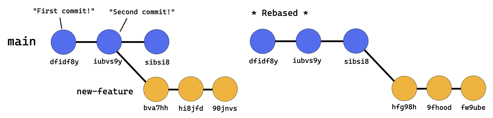

# Rebasing and Cherry-picking

In this section, you will explore two advanced Git techniques: rebasing and cherry-picking. These techniques allow you to manipulate your commit history and selectively apply changes from one branch to another.



## Rebasing

Rebasing is the process of reapplying commits on top of another branch or commit. It helps maintain a linear project history and avoids unnecessary merge commits.

To rebase your current branch's commits onto a base branch, use the following command:

```bash
git rebase <base_branch>
```

If there are any conflicts, resolve them and then proceed with the rebase using:

```bash
git rebase --continue
```

Be cautious when rebasing published commits, as it can cause confusion and conflicts for collaborators.

A great visualization of rebasing can be found [in this video](https://www.youtube.com/watch?v=0chZFIZLR_0) (and many other places).

## Cherry-picking

Cherry-picking allows you to selectively apply specific commits from one branch to another. This is useful when you need specific changes from another branch without merging the entire branch.

To apply a desired commit to your current branch, use the following command:

```bash
git cherry-pick <commit_hash>
```

If there are any conflicts, resolve them and then proceed with the cherry-pick using:

```bash
git cherry-pick --continue
```

Both rebasing and cherry-picking maintain the original commit authorship and date information. In both cases, however, the commit hash changes.


## Exercise 1 - Rebase vs Merge

For this exercise you will first set up your working tree with two feature branches A and B.

1. **Make a base repository to work in**

    - Go to your terminal and make sure you are working in `/workspaces/academy-git-fundamentals/exercise-folders`
    - create a new folder `cherry-picking` and initiate it with `git init`. 
    - Add some base files and add/commit.
    ```bash
    touch base1.txt base2.txt
    git add .
    git commit -m "Innitial commit"
    ```

2. **Add a new feature as worker A**

    - Create a new branch `feature-a` and switch to it.
    - Add a new file `A1.txt` and commit this with the message `"Add new feature A.1"`
    - Add a new file `A2.txt` and commit this with the message `"Add new feature A.2"`

3. **Add a new feature as worker B**
    - Checkout the main branch. 
    - Create a new branch `feature-b` and switch to it.
    - Add a new file `B1.txt` and commit this with the message `"Add new feature B.1"`
    - Use `git log --oneline` to see your working history
    - Use `git log feature-a --online` to see the log history of Worker A

Worker B now wants to pull the changes made by Worker A

4. **Experiment with `git merge` as Worker B**
    - **While on branch** `feature-b` create and checkout a new branch called `feature/merge`
    - Use the command `git merge feature-a`
    - Use `git log --oneline --graph` to see what has happened.

3. **Experiment with `git rebase` as Worker B**
    - Switch back to the `feature-b` branch.
    - Create and checkout a new branch called `feature/rebase`
    - Use the command `git rebase feature-a`
    - Use `git log --oneline --graph` to see what has happened.

***How does the output of merge compare to the output of rebase?***
## Exercise 1 - Cherry Picking

1. Go back to the main branch with `git checkout main`

1. Create and checkout a new branch `cherry-tree`

1. Edit the `base1.txt` file, stage it with `git add` and then commit the change with message `"The sweetest cherry!"`.

1. Add a new file called `rotten-cherry.txt`, stage and commit it with the message `"Ew! Sour!"`

1. Run `git log --oneline --graph` to see the commit history.

1. Switch back to the `main` branch and cherry-pick the sweet cherry from the `cherry-tree` branch

1. Run `git log --oneline --graph` to see the commit history.

1. In the `main` branch use `git status` to check your working tree is clean. Add and commit any changes with the commit message `"End of rebase and cherry picking exercises"